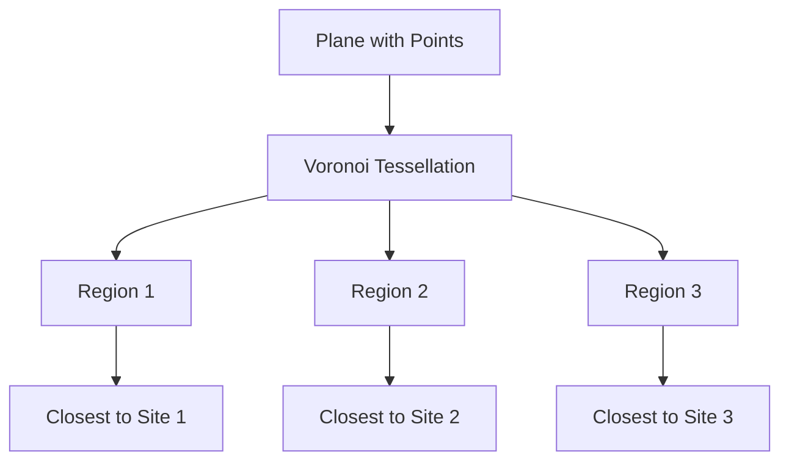
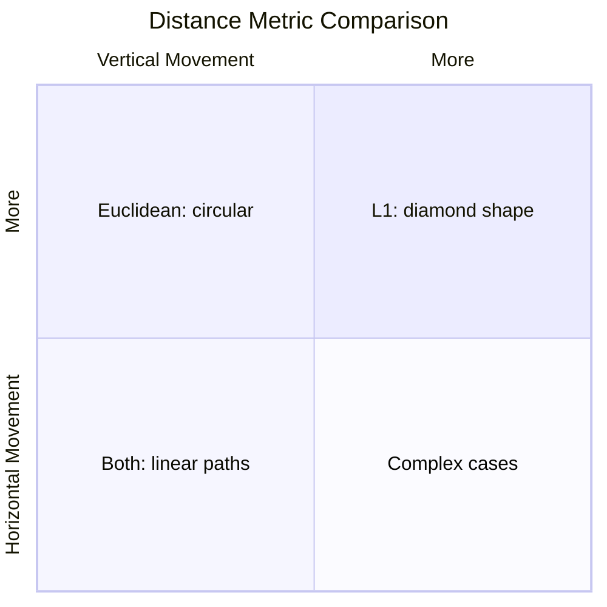
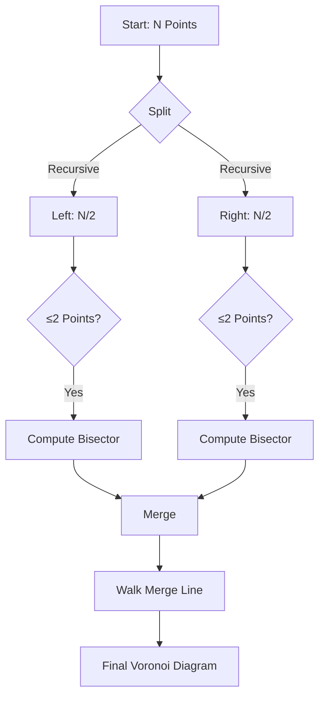
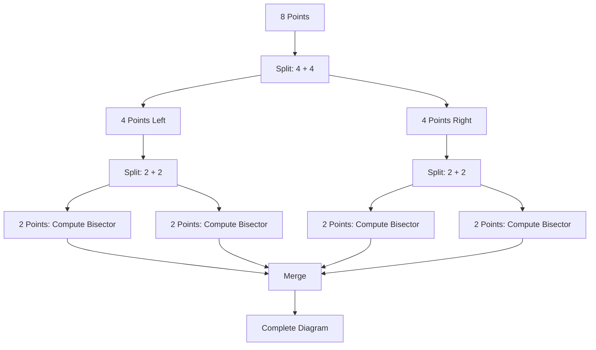
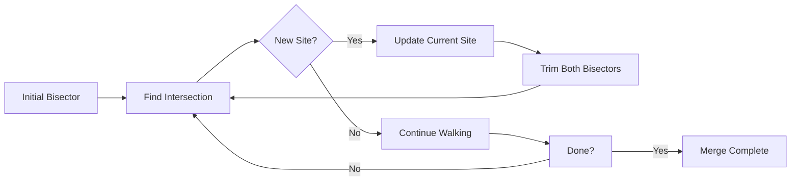
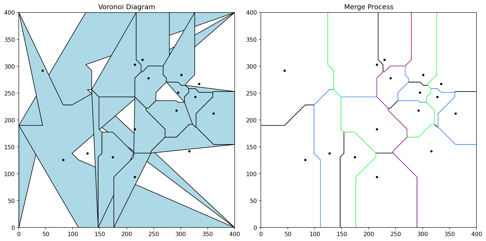
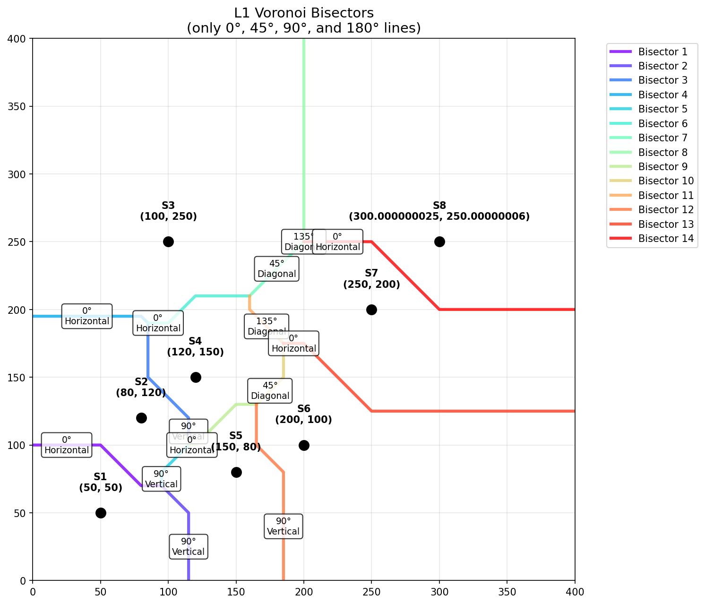
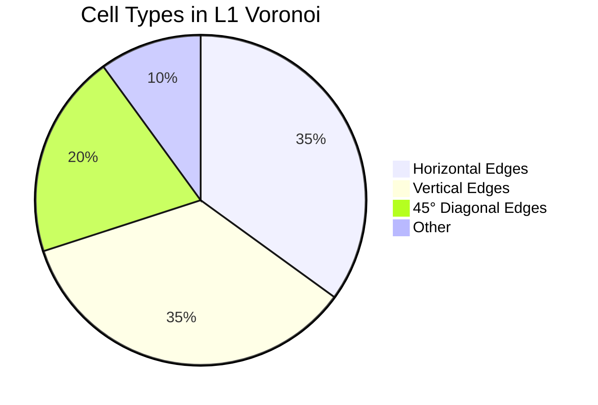
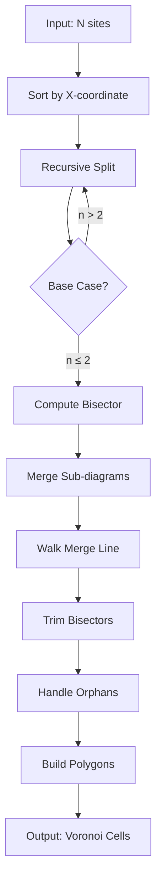

# 🚀 Rectilinear Voronoi Diagram

### L1 (Manhattan) Distance Based Voronoi Tessellation

---

## 📍 What is a Voronoi Diagram?

A **Voronoi diagram** partitions a plane into regions based on distance to a set of points (**sites**).

$$
V(p_i) = \{ x \in \mathbb{R}^2 : d(x, p_i) \leq d(x, p_j) \quad \forall j \neq i \}
$$

- Each region contains **one site**
- All points in a region are **closer** to that site than any other



---

## 📐 Euclidean vs L1 Distance

| **Metric** | **Formula** | **Visual** |
|------------|-------------|------------|
| **Euclidean** | $d_E(p, q) = \sqrt{(x_2-x_1)^2 + (y_2-y_1)^2}$ | Circle |
| **L1 (Manhattan)** | $d_1(p, q) = \|x_2-x_1\| + \|y_2-y_1\|$ | Diamond (rotated square) |



---

## 🎯 Rectilinear (L1) Voronoi Properties

1. **All bisectors are at 0°, 45°, 90°, or 180°** 📐
2. Cells are **convex polygons** with axis-aligned edges
3. More **efficient** for grid-based applications

### Key Insight:

For L1 distance, the bisector between two points $P_1(x_1, y_1)$ and $P_2(x_2, y_2)$:

$$
\begin{cases}
x = \frac{x_1 + x_2}{2} & \text{if } |x_1 - x_2| > |y_1 - y_2| \text{ (vertical)}\\[8pt]
y = \frac{y_1 + y_2}{2} & \text{if } |y_1 - y_2| > |x_1 - x_2| \text{ (horizontal)}\\[8pt]
y = \pm x + c & \text{if } |x_1 - x_2| = |y_1 - y_2| \text{ (diagonal } \pm 45^\circ\text{)}
\end{cases}
$$

---

## ⚠️ Square Bisector Problem

When $|x_1 - x_2| = |y_1 - y_2|$, the bisector is **ambiguous** (a square region where both points are equidistant)!

**Solution**: Point nudging - slightly perturb points to avoid equality:

```python
def clean_data(data):
    for i, e in enumerate(data):
        for j, d in enumerate(data):
            if i != j and abs(d[0] - e[0]) == abs(d[1] - e[1]):
                d[0] = d[0] + 1e-10 * d[1]
                d[1] = d[1] + 2e-10 * d[0]
    return data
```

---

## 🔬 Lee & Wong's Algorithm Overview

### Divide-and-Conquer Approach



**Complexity**: $O(n \log n)$

---

## 📊 Step 1: Compute L1 Bisector

Given two sites $P_1$ and $P_2$:

```python
def find_l1_bisector(p1, p2, width, height):
    x_dist = p1.x - p2.x
    y_dist = p1.y - p2.y
    midpoint = [(p1.x + p2.x)/2, (p1.y + p2.y)/2]
    
    # Vertical bisector (horizontal line)
    if abs(x_dist) == 0:
        return [[0, midpoint[1]], [width, midpoint[1]]]
    
    # Horizontal bisector (vertical line)
    if abs(y_dist) == 0:
        return [[midpoint[0], 0], [midpoint[0], height]]
    
    # Diagonal at 45°
    slope = -1 if y_dist / x_dist > 0 else 1
    intercept = midpoint[1] - midpoint[0] * slope
    # ... compute intersection points with boundary
```

---

## 🌳 Step 2: Recursive Splitting



**Base case**: When set has ≤ 2 points, compute bisector directly

---

## 🔗 Step 3: Walk Merge Line

The key algorithm - walking the boundary between two merged sub-diagrams:



**Key operations**:
- `bisector_intersection()` - find where bisectors cross
- `trim_bisector()` - crop at intersection point
- Handle **orphaned bisectors** (trapped regions)

---

## 🏗️ Data Structures

### Site Class
```python
class Site:
    def __init__(self, site):
        self.site = site          # [x, y] coordinates
        self.bisectors = []       # List of bisectors
        self.polygon_points = []  # Cell vertices
        self.neighbors = []       # Adjacent sites
```

### Bisector Class
```python
class Bisector:
    def __init__(self, sites, up, points, intersections):
        self.sites = sites        # [Site1, Site2]
        self.up = True/False       # Direction indicator
        self.points = []          # Endpoints
        self.intersections = []    # Intersection points
        self.merge_line = None     # Depth in recursion tree
```

---

## 🖼️ Visualization Examples

From our implementation:

| Image | Description |
|-------|-------------|
|  | Final Voronoi diagram with colored cells |
|  | All bisectors shown |



---

## 📈 Sample Output

Running with 8 points:

```
Generating clean L1 Voronoi diagram...
Points:
  1. [ 50,  50]
  2. [150,  80]
  3. [120, 150]
  4. [ 80, 120]
  5. [200, 100]
  6. [250, 200]
  7. [300, 250]
  8. [100, 250]

Successfully generated 8 Voronoi cells
  Cell 1: 6 vertices
  Cell 2: 5 vertices
  ...
```

---

## 🛠️ Implementation Summary

### Core Functions

| Function | Purpose |
|----------|---------|
| `generate_l1_voronoi()` | Main entry point |
| `recursive_split()` | Divide & conquer |
| `walk_merge_line()` | Merge sub-diagrams |
| `find_l1_bisector()` | Compute L1 bisector |
| `bisector_intersection()` | Find crossing points |
| `clean_data()` | Eliminate square bisectors |

### Key Features
- ✅ Object-oriented design (Site, Bisector classes)
- ✅ Handles edge cases (boundary, corners)
- ✅ Optional merge process visualization
- ✅ Nudge data to avoid degenerate cases

---

## 📱 Applications

### Where Rectilinear Voronoi Shines

1. **Urban Planning** 🏙️ - Facility location, delivery zones
2. **Cellular Networks** 📶 - Cell tower coverage
3. **VLSI Design** 💻 - Wire routing, placement
4. **Robotics** 🤖 - Path planning, sensor coverage
5. **Image Processing** 🖼️ - Segmentation, clustering
6. **Game Development** 🎮 - Procedural generation

### Advantage over Euclidean:
- **Faster computation** for grid-based systems
- **Axis-aligned boundaries** match pixel/grid structures
- **Better interpretability** in urban/warehouse contexts

---

## ⚡ Complexity Analysis

| Operation | Time | Space |
|-----------|------|-------|
| Bisector computation | $O(1)$ | $O(1)$ |
| Recursive splitting | $O(n \log n)$ | $O(n)$ |
| Merge process | $O(n)$ | $O(n)$ |
| **Total** | **$O(n \log n)$** | **$O(n)$** |

### Limitations
- ⚠️ Performance degrades with >100 points
- ⚠️ Some point configurations cause issues
- ⚠️ May produce duplicate vertices (post-processing needed)

---

## 🔄 Algorithm Flow Summary



---

## 🎓 Conclusion

### Key Takeaways

1. **Rectilinear Voronoi** uses L1 (Manhattan) distance
2. **Lee & Wong's algorithm** provides $O(n \log n)$ solution
3. **Bisectors** are restricted to 0°, 45°, 90°, 180° only
4. **Edge cases** handled via point nudging
5. **Practical** for grid-based applications

### Further Improvements
- Optimize for larger point sets
- Add parallel processing
- Implement Fortune's algorithm for comparison
- Handle weighted L1 distance

---

## ❓ Q&A

### Questions?

- 📧 Implementation: `voronoi.py`, `voronoi_clean.py`
- 🖼️ Demo: Run `python demo.py`
- 📚 Reference: Lee & Wong (1980) - "An Algorithm for the L1 Voronoi Diagram"

---

**Thank you!** 🙏

*Created from the Python implementation of Manhattan (L1) Voronoi Diagram*